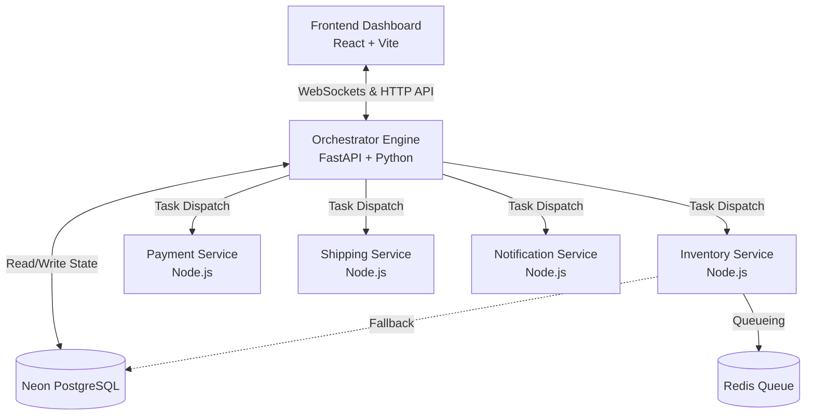

<div align="center">
  <h1>E-Commerce Workflow Orchestrator</h1>
  <p><strong>A High-Performance, Distributed Workflow Engine for E-Commerce</strong></p>
  <p><i>Built for the Northern Trust Hackathon (Group 6)</i></p>
</div>

---

## 📖 Overview
This project is a custom-built, fault-tolerant **DAG (Directed Acyclic Graph) Execution Engine** tailored for complex e-commerce workflows. It orchestrates distributed microservices (Inventory, Payment, Shipping, Notifications) while providing a real-time, interactive dashboard for monitoring execution states and handling human-in-the-loop approvals.

## ✨ Key Features
- **⚡ Non-Blocking Async Engine:** Custom Python DAG runner with thread-pooling for zero UI lag during intensive database I/O.
- **🔄 Real-Time WebSockets:** Live execution monitoring and graph rendering on the frontend via Socket.IO.
- **🛡️ Crash Recovery:** Fully backed by Neon PostgreSQL. Workflows gracefully resume from their exact state after backend restarts.
- **🙋 Human-in-the-Loop:** Built-in gateways pause workflows for manual operator approval (e.g., high-value orders > $500).
- **🛍️ Razorpay Integration:** Full frontend integration with Razorpay for handling interactive payment tasks.
- **🏗️ Distributed Microservices:** Independent Node.js services for Payment, Shipping, Notification, and Inventory.

---

## 🛠️ Technology Stack
* **Orchestrator Backend:** Python, FastAPI, AsyncIO, Python-SocketIO, Uvicorn
* **Database & Caching:** Neon (PostgreSQL), Redis
* **Frontend Dashboard:** React, Vite, Tailwind CSS, Razorpay
* **Microservices:** Node.js, Express, Axios/HTTPX

---

## 🏗️ Architecture



### Component Breakdown
1. **Frontend Dashboard:** Connects to the orchestrator via WebSockets. It visually renders workflow DAGs, highlights active tasks, provides payment gateways (Razorpay), and allows operators to approve/reject paused human tasks.
2. **Orchestrator Engine:** The "brain" of the system. It parses YAML workflow definitions, determines task execution order, dispatches HTTP requests to microservices, and logs all events asynchronously to the database.
3. **Database (Neon Postgres):** Stores the source-of-truth for active workflows, task histories, and system logs. Used by the orchestrator to recover execution states after sudden crashes.
4. **Microservices (Node.js):** Isolated services that mimic a real-world distributed architecture. The orchestrator delegates work to these services, waiting for them to complete their designated domain logic (like securing inventory or charging a credit card).

---

## 📂 Project Directory Structure

```text
Northern-Trust---Hackathon_Group6/
├── frontend/                   # React + Vite UI Dashboard
│   ├── src/                    
│   │   ├── components/         # Reusable UI elements (DAG viewer, Modals)
│   │   └── hooks/              # Custom hooks for WebSocket data streaming
├── orchestrator/               # Core Python Execution Engine
│   ├── app.py                  # FastAPI server & Socket.IO endpoints
│   ├── dag_runner.py           # DAG scheduling & execution logic
│   ├── task_executor.py        # Microservice dispatch routing & DB fallbacks
│   └── db.py                   # Neon PostgreSQL integration layer
├── workflows/                  # YAML Business Definitions
│   └── order_workflow.yaml     # The e-commerce execution schema
├── payment-service/            # Node.js Payment microservice
├── shipping-service/           # Node.js Shipping microservice
├── notification-service/       # Node.js Notification microservice
├── inventory-service/          # Node.js Inventory microservice
└── requirements.txt            # Python dependencies
```

---

## 🚀 Setup and Run Instructions

### 1. Start the Orchestrator Backend
```bash
cd orchestrator
python -m venv venv
source venv/bin/activate  # Or `.\venv\Scripts\activate` on Windows
pip install -r ../requirements.txt

# Start the non-blocking Uvicorn server
uvicorn app:socket_app --host 0.0.0.0 --port 4000
```

### 2. Start the Frontend Dashboard
```bash
# Open a new terminal window
cd frontend
npm install
npm run dev
```

### 3. (Optional) Start the Microservices
*Note: If `USE_REAL_SERVICES=false` in the orchestrator `.env`, the engine will intelligently mock service responses for local testing.*
To run real services, navigate to each service folder (`payment-service`, `shipping-service`, etc.), run `npm install`, and start them using `npm run start` or `node index.js`.

---

## 🧪 Testing the System
Once the backend and frontend are running, you can dispatch a workflow programmatically to see the system in action:
```bash
curl -X POST http://localhost:4000/api/v1/workflows/start \
-H "Content-Type: application/json" \
-d '{"workflow": "order-fulfillment", "input": {"order_id": "TEST-2026", "total_value": 750, "customer_id": "CUST-99"}}'
```
Watch the frontend dashboard automatically render the graph and light up in real-time as tasks progress!

---
